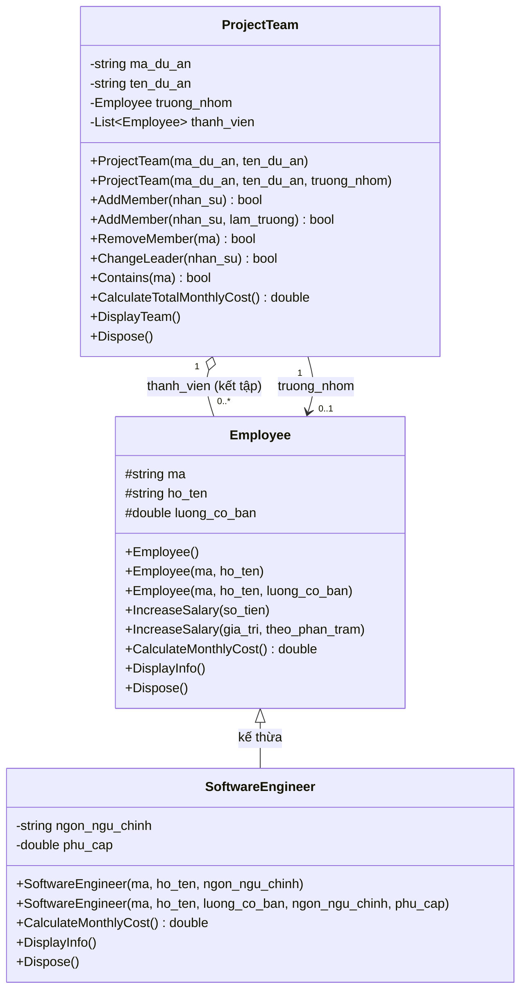

# Sơ đồ lớp - Nhóm dự án và Nhân sự

```mermaid
classDiagram
    class Employee {
        #string ma
        #string ho_ten
        #double luong_co_ban
        +Employee()
        +Employee(ma, ho_ten)
        +Employee(ma, ho_ten, luong_co_ban)
        +IncreaseSalary(so_tien)
        +IncreaseSalary(gia_tri, theo_phan_tram)
        +CalculateMonthlyCost() double
        +DisplayInfo()
        +Dispose()
    }

    class SoftwareEngineer {
        -string ngon_ngu_chinh
        -double phu_cap
        +SoftwareEngineer(ma, ho_ten, ngon_ngu_chinh)
        +SoftwareEngineer(ma, ho_ten, luong_co_ban, ngon_ngu_chinh, phu_cap)
        +CalculateMonthlyCost() double
        +DisplayInfo()
        +Dispose()
    }

    class ProjectTeam {
        -string ma_du_an
        -string ten_du_an
        -Employee truong_nhom
        -List~Employee~ thanh_vien
        +ProjectTeam(ma_du_an, ten_du_an)
        +ProjectTeam(ma_du_an, ten_du_an, truong_nhom)
        +AddMember(nhan_su) bool
        +AddMember(nhan_su, lam_truong) bool
        +RemoveMember(ma) bool
        +ChangeLeader(nhan_su) bool
        +Contains(ma) bool
        +CalculateTotalMonthlyCost() double
        +DisplayTeam()
        +Dispose()
    }

    Employee <|-- SoftwareEngineer : kế thừa
    ProjectTeam "1" o-- "0..*" Employee : thanh_vien (kết tập)
    ProjectTeam "1" --> "0..1" Employee : truong_nhom
```
